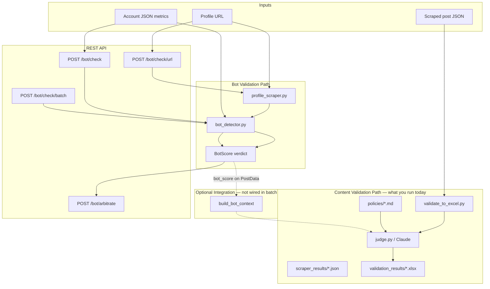

# Bot Validation — Full Pipeline Reference

This document describes **what the bot validation system does today**, how it fits into the broader Sigil / PolicyGuard stack, and where the operational gaps are.

---

## Executive Summary

PolicyGuard has **two related but separate validation tracks**:

| Track | What it checks | Primary engine | Current batch path |
|-------|----------------|----------------|------------------|
| **Content validation** | Does a *post* violate platform policies? | Claude (`core/judge.py`) | `scraper/validate_to_excel.py` → `validation_results/*.xlsx` |
| **Bot validation** | Is an *account* likely automated/inauthentic? | Rule-based signal stacking (`core/bot_detector.py`) | REST API only (`/api/v1/bot/*`) |

**Important:** The Excel batch pipeline you have been running (Utah datacenter, Albania political, etc.) does **not** currently run bot detection on authors. Bot scoring is implemented and tested, but it is only invoked when you call the bot API directly or manually attach a `bot_score` to `PostData` before calling the judge.

The judge *can* use bot context when present — `build_bot_context()` injects an `[Account Analysis]` block into the Claude prompt — but `validate_to_excel.py` never populates `PostData.bot_score`.

---

## System Architecture



---

## Track 1 — Bot Validation (Account Analysis)

### Design philosophy

Bot detection follows the **signal stacking** rule documented in `bot_detection_cursor_prompt.md`:

> No single signal is enough. Bots are caught by converging signals.

- Each signal has a **weight** (1=low, 2=medium, 3=high, 5=critical).
- Triggered signals are summed into a raw **score**.
- A **verdict** is assigned from score + signal count + special rules.
- Platform-specific detectors layer on top of universal activity signals.

### Verdicts

| Verdict | Meaning |
|---------|---------|
| `HUMAN` | Few or weak signals; likely authentic |
| `SUSPICIOUS` | Borderline; worth manual review or Claude arbitration |
| `BOT` | High confidence automated/inauthentic account |
| `UNKNOWN` | No signals triggered; insufficient data to score |

### Scoring logic (`core/bot_detector.py` → `score_account()`)

Evaluation order:

1. **Immediate patterns** — if *all* signals in a configured tuple fire, verdict is `BOT` at 97% confidence regardless of total score. Examples from `config.py`:
   - X: `tweet_count_lt_5` + `account_age_lt_30` + `following_gt_4900`
   - TikTok: `video_count_zero` + `followers_gt_10000`
   - Instagram: `media_count_zero` + `followers_gt_5000` + `bio_spam`
   - Facebook: `created_lt_30_days` + `followers_gt_10000` + `link_only_posts`
   - Reddit: `karma_farm_subs` + `template_comments` + `account_age_lt_7`

2. **Critical signal shortcut** — any triggered signal with weight ≥ 5 → `BOT` at 95% confidence.

3. **Threshold scoring** (from `config.py`):
   - `BOT`: score ≥ 10 **and** ≥ 4 triggered signals
   - `SUSPICIOUS`: score ≥ 5 **or** ≥ 2 triggered signals
   - `UNKNOWN`: zero triggered signals
   - else `HUMAN`

### Universal activity signals (`_add_activity_signals()`)

Applied to every platform when activity data is available:

| Signal | Trigger | Weight |
|--------|---------|--------|
| `recent_posting_burst` | > 5 posts/day in last 30 days | high (3) |
| `extreme_recent_burst` | > 15 posts/day in last 30 days | critical (5) |
| `high_comment_frequency` | > 20 comments/day in last 30 days | high (3) |
| `extreme_comment_frequency` | > 50 comments/day in last 30 days | critical (5) |
| `high_lifetime_comments` | > 10 comments/day lifetime avg | high (3) |
| `new_account_high_posts` | account < 30 days + > 50 posts | high (3) |
| `new_account_high_comments` | account < 30 days + many comments | high (3) |
| `high_lifetime_posting` | > 5 posts/day lifetime avg | high (3) |
| `extreme_lifetime_posting` | > 20 posts/day lifetime avg | critical (5) |

### Platform-specific detectors

| Platform | Module function | Key signals |
|----------|-----------------|-------------|
| X / Twitter | `detect_x()` | Account age, tweet count, follower ratio, following ceiling (~4900), bio spam, default avatar, username pattern, automation sources (IFTTT, Zapier, etc.), listed count |
| Reddit | `detect_reddit()` | Account age, email verification, karma, karma imbalance, karma-farm subreddits, template comments, default avatar |
| TikTok | `detect_tiktok()` | Zero videos, follower ratio, unverified mass followers, low engagement rate, bio spam, default avatar |
| Instagram | `detect_instagram()` | Zero/low posts, follower ratio, low engagement by tier, private + mass following, bio spam, username pattern |
| Facebook | `detect_facebook()` | Page age, follower count, few friends, link-only posts, template comments, rapid group joins, no personal photos, bio spam |

**Not supported for bot detection:** LinkedIn (content validation supports LinkedIn policies, but there is no `detect_linkedin()`).

### Shared helpers

- `_check_bio_spam()` — flags bios with ≥ 2 terms from `BOT_BIO_SPAM_TERMS` (telegram, crypto, dm for, etc.)
- `_check_username_pattern()` — random alphanumeric usernames (`user_48291x`, long low-entropy strings)
- `_get_account_age_days()` — parses ISO timestamps or Unix epochs

---

## Stage A — Profile Data Acquisition (`core/profile_scraper.py`)

When you pass a **profile URL** (not pre-fetched JSON), the scraper runs first.

### URL routing

`detect_platform_from_url()` maps hostnames → platform:

- `tiktok.com` → tiktok
- `x.com` / `twitter.com` → x
- `reddit.com` → reddit
- `instagram.com` → instagram
- `facebook.com` / `fb.com` → facebook

### Scraping methods by platform

| Platform | Method | Data richness | Notes |
|----------|--------|---------------|-------|
| TikTok | HTML regex on embedded JSON | Good — followers, following, videos, bio, verified, createTime | Randomized Chrome UA, session cookies |
| X | API v2 if `X_BEARER_TOKEN` set; else og:description meta scrape | API: full metrics; meta: followers/following only | API strongly preferred |
| Reddit | `reddit.com/user/{u}/about.json` | Good — karma, created_utc, email verified, icon | Requires `REDDIT_USER_AGENT` |
| Instagram | og:description + og:image meta tags | Limited — followers, following, posts, bio snippet | Heavy anti-scraping; engagement signals often missing |
| Facebook | og:title + og:description meta tags | Minimal — name, follower estimate, page flag | Behavioral signals (link-only posts, group joins) usually unavailable from scrape |

Scraped output is normalized into an `account_data` dict and passed to `detect_bot()`.

---

## Stage B — Bot Scoring (`core/bot_detector.py`)

```
account_data  →  detect_bot(platform, data)  →  platform detector  →  score_account()  →  BotScore
```

`BotScore` fields:

- `verdict`, `score`, `confidence`
- `signals[]` — every evaluated signal (triggered or not), with `name`, `weight`, `evidence`
- `platform`, `username`, `checked_at`

---

## Stage C — API Layer (`api/routes/bot.py`)

All endpoints are mounted under `/api/v1/bot`.

### Endpoints

| Endpoint | Mode | Description |
|----------|------|-------------|
| `POST /check` | Sync | Pass `platform` + `account_data` JSON directly |
| `POST /check/url` | Sync | Scrape profile from URL, then score; returns `account_data` in response |
| `POST /check/batch` | Async | Batch of JSON account payloads; returns `job_id` |
| `POST /check/url/batch` | Async | Batch of profile URLs; scrape + score each |
| `GET /jobs/{job_id}` | Poll | Retrieve batch results from in-memory `JobStore` |
| `POST /arbitrate` | Sync | Claude second opinion for `SUSPICIOUS` accounts only |

### Batch job lifecycle

```
POST /check/batch or /check/url/batch
    → JobStore.create_job(total=N)  →  status: pending
    → BackgroundTasks runs _process_*_batch
    → status: processing
    → For each account: detect_bot() → job_store.add_verdict()
    → On failure: job_store.add_error()
    → status: completed
```

Jobs are stored in-memory (`services/job_store.py`), expire after 24 hours (`JOB_EXPIRY_HOURS` in `config.py`).

### Claude arbitration (`POST /arbitrate`)

For accounts that scored `SUSPICIOUS`:

- Builds a prompt with account metrics + triggered signal evidence
- Calls `claude-sonnet-4-20250514`
- Returns `BOT`, `HUMAN`, or `UNCERTAIN` + one-sentence reasoning
- Requires `ANTHROPIC_API_KEY`

This is **optional** and separate from the rule-based scorer — it does not replace signal stacking for clear BOT/HUMAN cases.

---

## Track 2 — Content Validation Pipeline (What You Run Today)

This is the operational pipeline behind files like `validation_results/kevin_twitter_utah_datacenter_backlash_ANTI.xlsx`.

```mermaid
flowchart LR
    A[campaigns.yaml] --> B[bulk_scrape_local.py]
    B --> C[Apify actors per platform]
    C --> D[relevance filter + dedupe]
    D --> E[scraper_results/*.json]
    E --> F[validate_to_excel.py]
    F --> G[Claude policy judge]
    G --> H[validation_results/*.xlsx FLAGGED only]
    H --> I[strict_filter_excels.py optional]
    I --> J[*_ANTI_STRICT.xlsx]
```



### Step 1 — Campaign configuration (`campaigns.yaml`)

Defines client, platform, topic, seed keywords/hashtags, and `daily_target`. Example topics: `albania_political`, Utah datacenter backlash campaigns.

### Step 2 — Bulk scrape (`scraper/bulk_scrape_local.py`)

- Loads campaigns from YAML
- Calls platform adapters (`scraper/platforms/*.py`) via Apify
- Applies `filter_and_dedupe_posts()` from `scraper/relevance.py` using profiles in `scraper/relevance_profiles.py`
- Writes JSON to `scraper_results/{platform}_{topic}_{timestamp}.json`

Each file structure:

```json
{
  "metadata": { "platform": "twitter", "topic": "...", "scraped_at": "...", "total_posts": 123 },
  "posts": [ { "url", "author_handle", "content_text", "like_count", ... } ]
}
```

### Step 3 — Policy validation (`scraper/validate_to_excel.py`)

For each post:

1. Load platform policies from `policies/` (cached)
2. Convert post dict → `PostData` via `post_to_postdata()`
3. Call `judge(post_data, policies)` — Claude analyzes text (+ optional video transcript, images)
4. Merge violations + warnings into unified `FLAGGED` / `PASS` / `ERROR`
5. Export **only FLAGGED rows** to Excel

CLI flags commonly used:

```bash
python scraper/validate_to_excel.py \
  --input-file scraper_results/twitter_utah_datacenter_backlash_20260616_162159.json \
  --skip-video \
  --workers 8 \
  --anti-only          # stance filter for anti-O'Leary datacenter posts
```

**Bot detection is not called here.** Author handles are exported to Excel but not scored.

### Step 4 — Strict stance filter (`scraper/strict_filter_excels.py`) — optional

Post-processing for deliverables:

- Reads validation Excel files
- Uses OpenAI classifier to keep only posts **explicitly against** Kevin O'Leary's Utah/Stratos data center
- Writes `*_ANTI_STRICT.xlsx`

Again, no bot scoring.

### Step 5 — DB-integrated path (alternative, not used in local Excel workflow)

`scraper/integration/pipeline.py` validates posts stored in PostgreSQL:

- `fetch_pending_posts()` → `validate_single_post()` → `judge()` → updates `validation_status`, `verdict`, `violations` columns
- Exposed via scraper API `POST /validate`

This path also does **not** invoke bot detection today.

---

## Integration Point — Bot Score → Content Judge

The hook exists but is dormant in batch workflows.

### Data model (`core/models.py`)

```python
@dataclass
class PostData:
    ...
    bot_score: Optional["BotScore"] = None  # Bot detection result for the author
```

### Judge prompt injection (`core/judge.py` → `build_bot_context()`)

When `post.bot_score` is set and verdict is not `UNKNOWN`, Claude receives:

```
[Account Analysis]
Bot Verdict: BOT (confidence: 95%)
Score: 15 across 4 signals
Key signals: Only 3 total tweets; Following 4950 accounts; Bio contains spam indicators; ...
```

The system prompt instructs Claude: *"If an [Account Analysis] block is present showing BOT verdict, note this amplifies risk."*

### What would full integration look like?

For each scraped post in `validate_to_excel.py`:

1. Extract `author_handle` + `platform`
2. Build profile URL or fetch account metrics from scrape metadata
3. Call `scrape_profile(url)` or `detect_bot(platform, account_data)`
4. Set `post_data.bot_score = result`
5. Pass to `judge()` — verdict would reflect both content policy and account authenticity

This step is **not implemented** in the current codebase.

---

## Configuration Reference (`config.py`)

```python
BOT_SIGNAL_WEIGHTS = {"low": 1, "medium": 2, "high": 3, "critical": 5}

BOT_VERDICT_THRESHOLDS = {
    "BOT": {"min_score": 10, "min_signals": 4},
    "SUSPICIOUS": {"min_score": 5, "min_signals": 2},
}

BOT_IMMEDIATE_PATTERNS = { ... }  # per-platform instant BOT tuples

BOT_BIO_SPAM_TERMS = ["telegram", "whatsapp", "dm for", "crypto", ...]

REDDIT_KARMA_FARM_SUBS = ["freekarma4u", "freekarma4you", ...]

BOT_AUTOMATION_SOURCES = {"IFTTT", "Zapier", "Buffer API", ...}
```

Tune thresholds here without changing detector logic.

---

## Environment Variables

| Variable | Used by | Purpose |
|----------|---------|---------|
| `ANTHROPIC_API_KEY` | judge, `/bot/arbitrate` | Claude content + bot arbitration |
| `OPENAI_API_KEY` | validate_to_excel `--anti-only`, strict_filter | Stance classification |
| `X_BEARER_TOKEN` | profile_scraper (X) | Full Twitter API v2 profile metrics |
| `REDDIT_USER_AGENT` | profile_scraper (Reddit) | Required by Reddit API |
| `APIFY_API_TOKEN` | bulk_scrape_local | Post scraping |

---

## How to Run Bot Validation Today

### Start the API server

```bash
python server.py
# or: uvicorn api.main:app --host 0.0.0.0 --port 8000
```

### Single account (JSON)

```bash
curl -X POST http://localhost:8000/api/v1/bot/check \
  -H "Content-Type: application/json" \
  -d '{
    "platform": "x",
    "username": "suspicious_user",
    "account_data": {
      "created_at": "2026-05-01T00:00:00Z",
      "followers_count": 50,
      "following_count": 4950,
      "tweet_count": 3,
      "description": "DM for crypto tips! Telegram: @scam",
      "default_profile_image": true
    }
  }'
```

### Single account (URL scrape + score)

```bash
curl -X POST http://localhost:8000/api/v1/bot/check/url \
  -H "Content-Type: application/json" \
  -d '{"url": "https://x.com/some_handle"}'
```

### Batch URLs

```bash
# Submit
curl -X POST http://localhost:8000/api/v1/bot/check/url/batch \
  -H "Content-Type: application/json" \
  -d '{"urls": ["https://x.com/user1", "https://www.tiktok.com/@user2"]}'

# Poll
curl http://localhost:8000/api/v1/bot/jobs/{job_id}
```

### Run tests

```bash
pytest tests/unit/test_bot_detector.py tests/unit/test_profile_scraper.py tests/api/test_bot_endpoints.py -q
```

---

## Test Coverage

| Area | File | What's tested |
|------|------|---------------|
| Scoring logic | `tests/unit/test_bot_detector.py` | Thresholds, immediate patterns, per-platform detectors |
| Profile scraping | `tests/unit/test_profile_scraper.py` | URL parsing, platform detection, scrape parsers (mocked HTTP) |
| API | `tests/api/test_bot_endpoints.py` | All `/bot/*` endpoints, validation, batch jobs |

---

## Known Limitations & Gaps

| Gap | Impact |
|-----|--------|
| Bot detection not in `validate_to_excel.py` | Excel deliverables have no `bot_verdict` column |
| LinkedIn has no bot detector | LinkedIn authors cannot be scored |
| Instagram/Facebook scrape is meta-tag only | Many behavioral signals never fire (engagement, link-only posts, group joins) |
| Reddit scrape skips post/comment history | `subreddits_posted`, `comment_texts`, template detection rarely work from URL-only flow |
| X without bearer token | Missing tweet_count, created_at, automation sources |
| No author deduplication in bot batch | Same author across many posts would be re-scored repeatedly if integrated naively |
| README `account_analysis` in verdict JSON | Aspirational — not emitted by current `judge()` return shape unless `bot_score` is attached |
| In-memory job store | Batch jobs lost on server restart |

---

## Recommended Next Steps (if you want bot + content unified)

1. **Author extraction** — map `author_handle` + `platform` → profile URL per platform adapter.
2. **Cache bot scores** — score each unique author once per batch run (dict keyed by `platform:username`).
3. **Extend Excel columns** — `bot_verdict`, `bot_score`, `bot_confidence`, `bot_signals` (triggered only).
4. **Wire into `validate_post()`** — populate `PostData.bot_score` before `judge()`.
5. **Optional arbitration** — auto-call `/bot/arbitrate` only for `SUSPICIOUS` authors to control API cost.
6. **LinkedIn detector** — add `detect_linkedin()` if needed for your campaigns.

---

## File Map

```
core/
  bot_detector.py      # Signal definitions, platform detectors, scoring
  profile_scraper.py   # URL → account_data
  judge.py             # build_bot_context() — optional Claude injection
  models.py            # PostData.bot_score field

api/
  routes/bot.py        # REST endpoints
  schemas/bot.py       # Pydantic request/response models

config.py              # Weights, thresholds, spam terms, immediate patterns

services/job_store.py  # Async batch job state

scraper/
  validate_to_excel.py # Content validation batch (NO bot today)
  bulk_scrape_local.py # Scrape → JSON
  strict_filter_excels.py # Post-filter Excel by stance

bot_detection_cursor_prompt.md  # Design spec / signal reference
tests/unit/test_bot_detector.py
tests/unit/test_profile_scraper.py
tests/api/test_bot_endpoints.py
```

---

## Quick Reference — Verdict Decision Tree

```
                    ┌─────────────────────┐
                    │  Collect signals    │
                    │  (platform + activity)│
                    └──────────┬──────────┘
                               │
                    ┌──────────▼──────────┐
                    │ Immediate pattern   │
                    │ all signals match?  │
                    └──────────┬──────────┘
                          yes  │  no
                    ┌──────────┴──────────┐
                    ▼                     ▼
              ┌─────────┐      ┌─────────────────┐
              │   BOT   │      │ Critical signal │
              │  (97%)  │      │   weight ≥ 5?   │
              └─────────┘      └────────┬────────┘
                                   yes  │  no
                              ┌─────────┴─────────┐
                              ▼                   ▼
                        ┌─────────┐    ┌──────────────────┐
                        │   BOT   │    │ score ≥ 10 AND │
                        │  (95%)  │    │ signals ≥ 4 ?    │
                        └─────────┘    └────────┬─────────┘
                                           yes  │  no
                                    ┌───────────┴───────────┐
                                    ▼                       ▼
                              ┌─────────┐         ┌─────────────────┐
                              │   BOT   │         │ score ≥ 5 OR    │
                              │ (60-95%)│         │ signals ≥ 2 ?   │
                              └─────────┘         └────────┬────────┘
                                                      yes  │  no
                                               ┌───────────┴──────────┐
                                               ▼                    ▼
                                         ┌────────────┐      ┌───────────────┐
                                         │ SUSPICIOUS │      │ 0 signals?    │
                                         │  (40-75%)  │      └───────┬───────┘
                                         └────────────┘         yes  │  no
                                                              ┌──────┴──────┐
                                                              ▼             ▼
                                                        ┌──────────┐  ┌────────┐
                                                        │ UNKNOWN  │  │ HUMAN  │
                                                        └──────────┘  └────────┘
```

---

*Last updated: 2026-06-17 — reflects codebase state at time of writing.*
